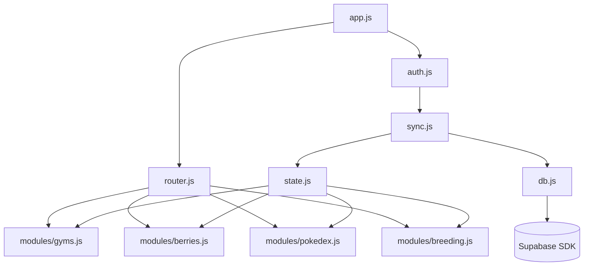

# Arquitectura: PokeMMO Terminal

## Visión General del Proyecto
PokeMMO Terminal es una Single Page Application (SPA) orientada a jugadores de PokeMMO. Su propósito es ser una herramienta "todo en uno" donde los usuarios pueden gestionar, optimizar y planificar de forma eficiente aspectos del juego.

## Stack Tecnológico
- **HTML5:** Estructura semántica básica.
- **TailwindCSS (CDN):** Clases utilitarias rápidas para el diseño y el sistema de grillas/flexbox, permitiendo prototipar e implementar la UI de forma veloz sin compilar CSS extra.
- **Vanilla JavaScript (ES Modules):** Código estructurado y modularizado de forma nativa sin depender de frameworks adicionales como React o Vue, lo cual mantiene la aplicación ligera.
- **Supabase (CDN):** Provee la base de datos backend, la autenticación y políticas de RLS, facilitando una sincronización de datos en tiempo real mediante su SDK para JavaScript.

## Estructura de Directorios

```text
happy-raman/
├── index.html
├── css/
│   └── styles.css
├── js/
│   ├── app.js
│   ├── auth.js
│   ├── db.js
│   ├── sync.js
│   ├── state.js
│   ├── router.js
│   ├── modules/
│   │   ├── gyms.js
│   │   ├── berries.js
│   │   ├── pokedex.js
│   │   └── breeding.js
│   └── utils/
│       ├── dom.js
│       ├── format.js
│       └── api.js
├── data/
│   ├── pokemmo_db.json
│   └── pre_evos_map.json
├── docs/
│   ├── ARCHITECTURE.md
│   ├── DATABASE.md
│   └── MODULES.md
└── supabase/
    └── migrations/
```

## Diagrama de Dependencias de Módulos



## Flujo de Datos
**Auth → State → Supabase → UI**
1. **Auth:** El usuario ingresa a la aplicación. Las credenciales se verifican contra Supabase y se recupera la sesión de usuario activa.
2. **State & DB:** La información particular del jugador para la vista requerida se carga desde Supabase usando el módulo `db.js`.
3. **Sync:** El módulo `sync.js` se encarga de reaccionar a cambios en línea/fuera de línea. Además interactúa con `state.js`.
4. **UI:** Con base en el estado local actual, se manipula de forma segura el DOM (apoyado por los helpers en `utils/`) para reflejar los datos al jugador.

## Cómo Añadir un Nuevo Módulo / Pestaña
1. **Crear script del módulo:** En `js/modules/`, crea `nuevo_modulo.js`. Asegúrate de seguir la convención exportando las funciones de `init()`, `render()` y de manejo de eventos pertinentes.
2. **Configurar la Interfaz de Usuario:** En el archivo `index.html`, añadir una nueva estructura para la vista o generarla dinámicamente usando el JS para ese módulo.
3. **Registrar la Ruta:** En `js/router.js`, mapea el `id` o la ruta de la pestaña nueva con el llamado de iniciación y renderizado de tu módulo creado, asegurando así que cargue solo al estar activo.
4. **Configurar el Estado Global (Si aplica):** Actualiza `js/state.js` para registrar el nuevo modelo y `js/db.js` para realizar el puente de lectura/escritura hacia la base de datos Supabase.

## Convenciones de Programación
- **ES Modules:** Todo archivo JS debe usar `import`/`export`.
- **Vanilla JS:** Prohibido el uso de frameworks no aprobados en el Stack; esto incluye jQuery.
- **Manipulación de DOM Segura:** Para crear elementos y evitar inyección de código de terceros, es imperativo el uso de las funciones auxiliares de `js/utils/dom.js` (no usar raw innerHTML de manera arbitraria).
- **Idioma y UI:** Toda cadena de texto e instrucción visual debe encontrarse en **español**.
- **Apariencia Consistente:** Font "JetBrains Mono" para valores de base de datos/números y "Inter" para la UI principal de la aplicación. Mantener la paleta de colores oficial.
